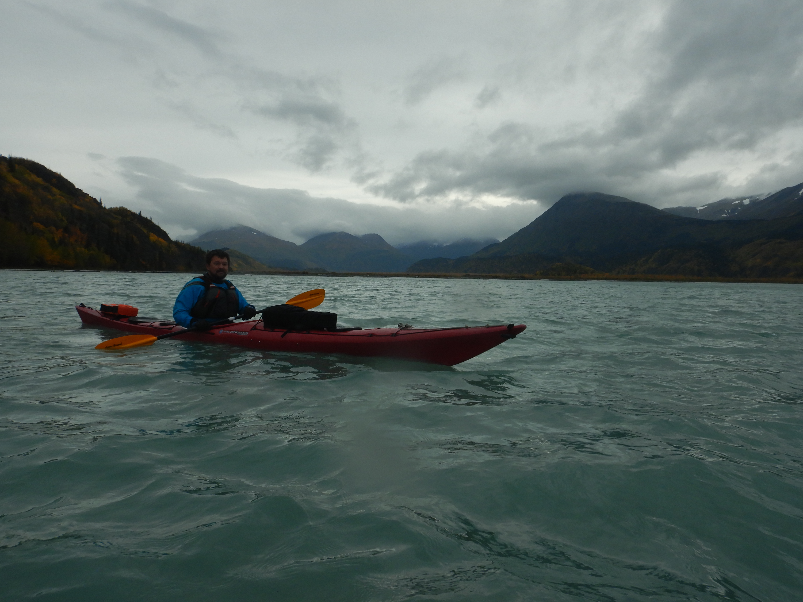
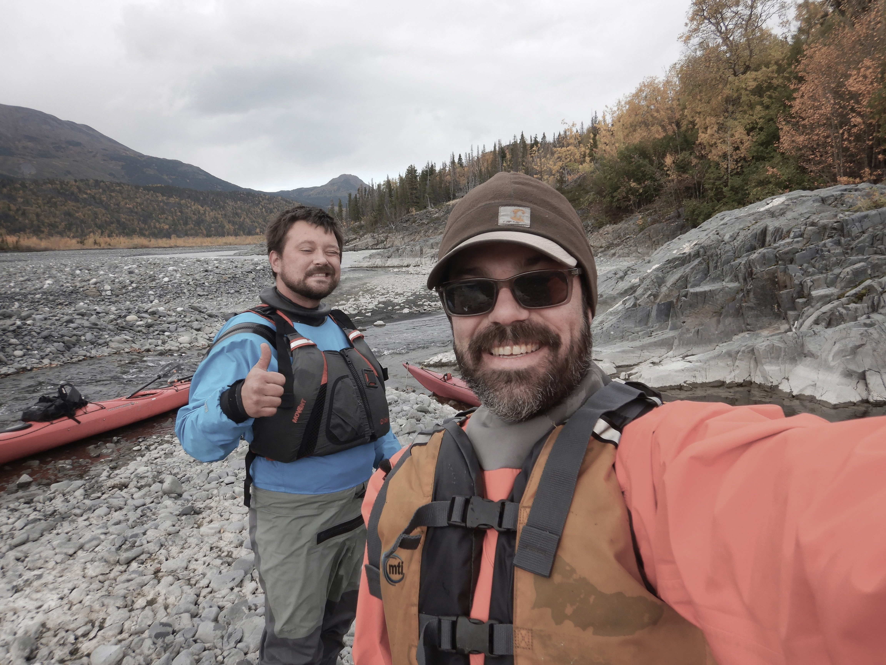
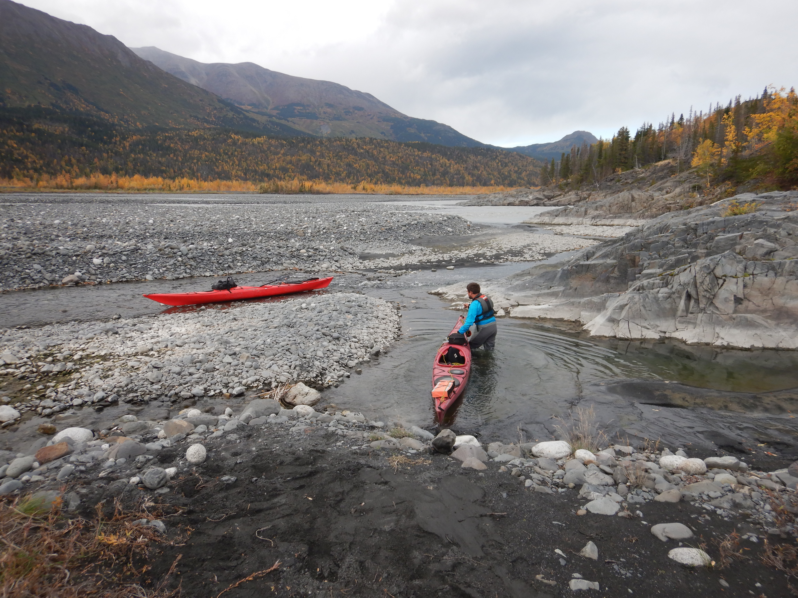
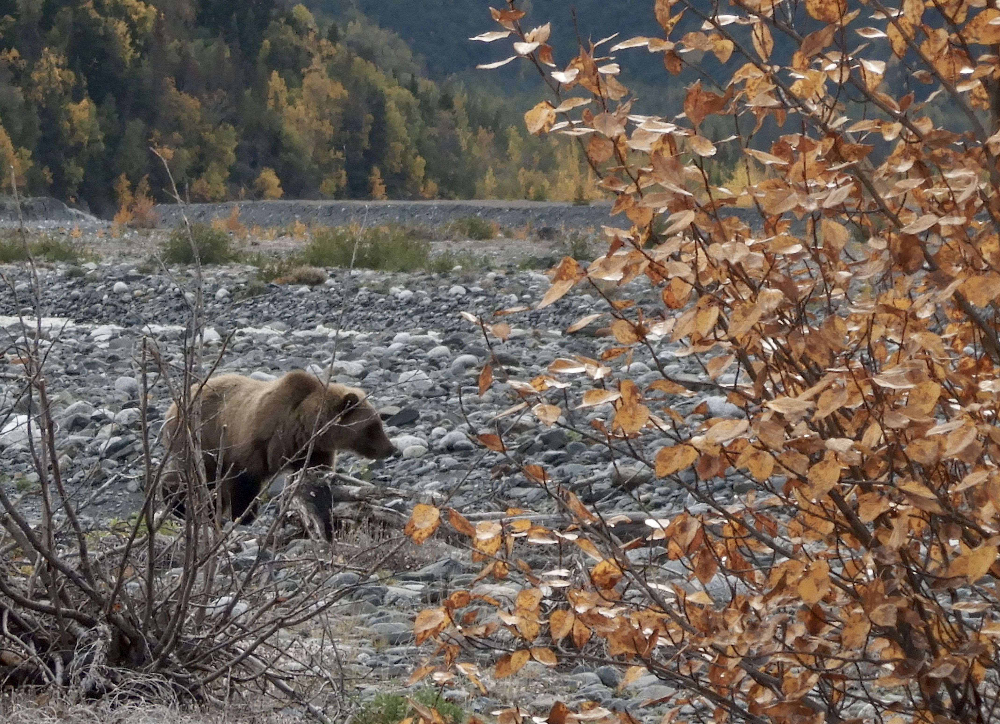
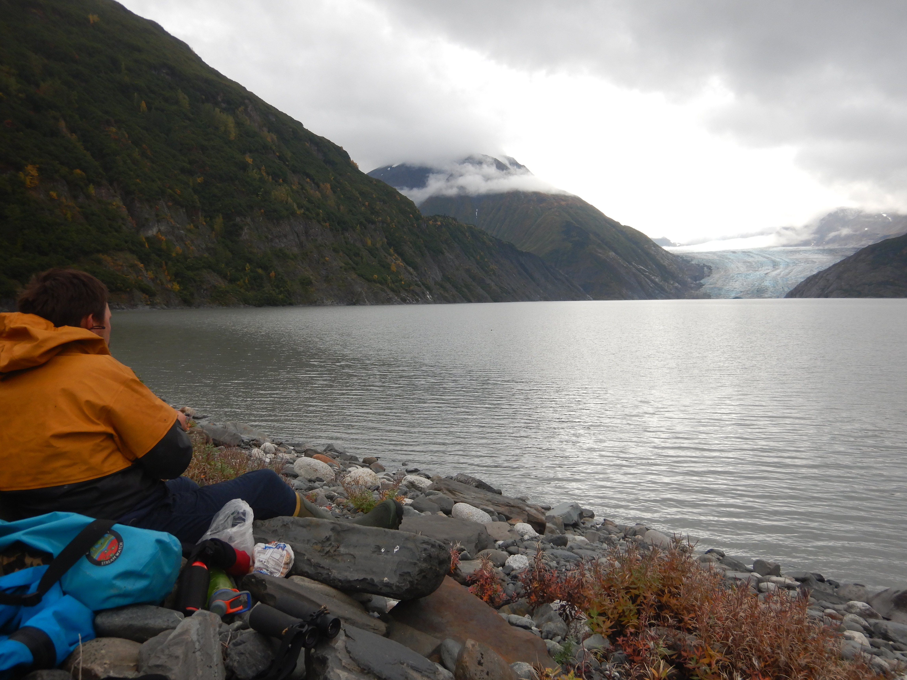
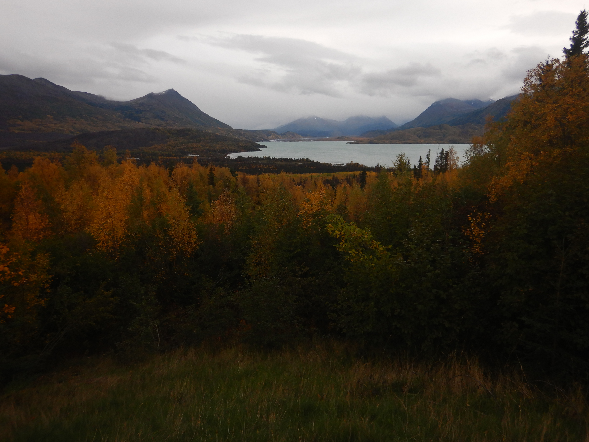

In late September 2022, a friend from my UAF undergraduate years Justin and I embarked on a three-night sea kayak trip out of Whittier. Unfortunately we didn't get farther than the Lazy Otter, a cozy coffee shop by the city boat harbor. Whitecaps rolled by as high winds and waves pelted the windows, a force in equal measure to the angry glares of boat captains chastising us for our choice of watercraft. "DON'T DO IT!" shouted one from through the gale upon seeing our boats prepped with gear. "Boy I'm not looking forward to being out there today even in my 40 ft skiff," groused another.

We considered our choices: drink six more cappuccinos at the Lazy Otter and wait for a break in the weather, or dream up some other adventure like heading back to Anchorage to scuttle the pirate ship at [H2Oasis](https://www.h2oasiswaterpark.com/). After poring over some maps we decided to head two hours further down the road to Skilak Lake, a 100 square kilometer turquoise jewel mid-way through the Kenai River where we hoped for calmer weather. We had three days to explore and aimed our sights towards visiting nearby Skilak Glacier; one of the largest sources of the Kenai River.

An academic tangent - I had always wanted to get to know this area better. In research I had been involved with at UAF, my colleagues and I sometimes used the fate of Skilak Glacier and the small proglacial lake at it's toe as an example of the complex blend of pros and cons when it comes to a warming world and what it means for salmon habitat [@schoen2017]. The glacier has receded by \~4 km in the last half century; and as a result a new 6 km^2^ lake has formed at the toe in it's slow wake. While these changes affect the flow and temperature of the river, this new lake potentially serves as new juvenile salmon nursery habitat; and there are likely many such examples like this all throughout the Gulf of Alaska region. Do these two different consequences of climate change - the shifting forces of flow and temperature and newly-born nursery habitat balance each other out when it comes to "good" for salmon habitat? We're not really sure, but we'll be finding out. I encourage those interested to check out the interactive graphic slider to see what I mean (click the image below or go to <https://ak-nsf-epscor.github.io/kenai-change/skilakGlacierChange.html>). For even more Skilak Glacier chatter, [check out this post from Dr. Mauri Pelto](https://blogs.agu.org/fromaglaciersperspective/2019/03/01/skilak-glacier-alaska-retreat-and-salmon-connection/).

It was a calm paddle from the Upper Skilak boat launch across the lake towards the Skilak River floodplain. On reaching the mouth of the river we discovered that sea kayaks were no match for the force of this relatively short glacial run. We stepped out onto the braided shore and lined the boats upstream from that point on.

Lining sea kayaks up a fast glacial stream for a whole day is a fairly absurd choice for the average adventure. Justin is no average adventurer though; having covered wide swaths of Alaska and the Great Lakes in a kayak over many journeys of multiple months. This seemed normal, a walk in the park. For anyone else considering this route, hiking with packrafts is probably the way to go; or perhaps a zodiac with a jet outboard.

Our campsite on the second night \~4 miles upstream from Skilak Lake offered just a peek of the massive glacier around the corner. We decided to hike sans boats the rest of the up to the source the next day.

Starting out on our stroll, we encountered a trio of grizzlies galloping purposefully somewhere in the opposite direction of us. We crossed paths from a distance like two groups of pedestrians on opposite sidewalks.

A few more miles of open-country walking along the river bank brought us to the new lake at the toe of the glacier. It was a neat experience to visit in-person this place that I had spent a lot of time thinking about in school.

The next day, a quick half-hour float back out to the lake and a very bumpy crossing back to the boat launch took us home. The picture below is a view of the floodplain valley and lake that we had just come all the way down from and and across.

It was an amazing trip and I hope to back someday soon. I'd especially like to link up this route with a different ending destination. Maybe a cross over to the valley to the east to Upper Russian Lake and then packraft back down to Cooper Landing? A jaunt across the Harding Icefield and a float back down to Seward? I'll pore over some maps and see which one looks like the least bushwhacking for next summer. Some days its hard to believe all this adventure is just out the back yard!

**References**
